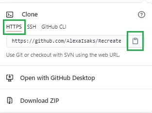
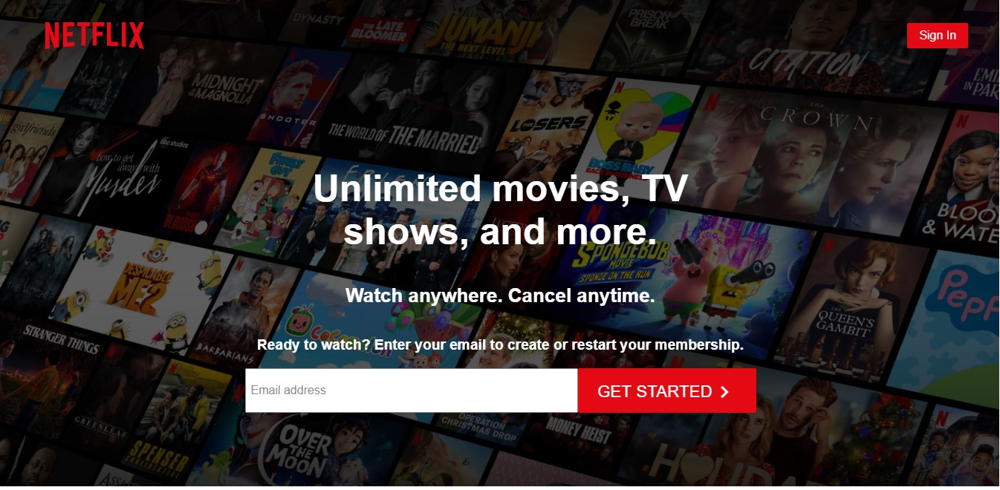
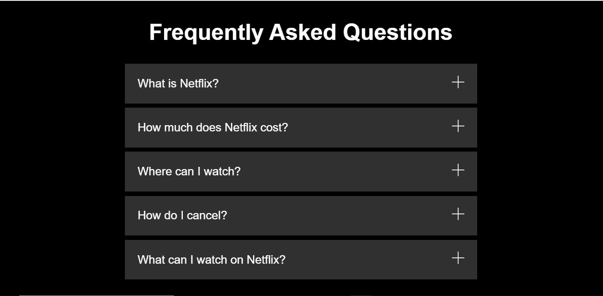
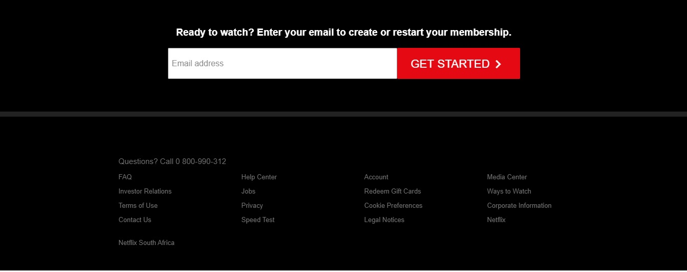

<h1 align="center">Recreate Netflix</h1>

Recreate any published webpage as best as you can. [Netflix](https://www.netflix.com/za/) webpage was chosen for this task.

## Table of Contents

* [About the Project](#about-the-project)
* [Installation](#installation)
* [Usage](#usage)
* [Acknowledgments](#acknowledgments)

## About the Project

 

Applying SASS to the task was the core focus.

## Installation

* Select the green **Code** button  

  

* Select HTTPS and copy the URL 

   

* Open Git Bash.
* Change to the directory/folder where you want to clone the repository.
* To clone the repository, type `git clone` followed by the URL. 

  `$ git clone https://github.com/AlexaIsaks/Recreate-Netflix.git`

* Press **Enter**. The repository will be cloned in your folder.

## Usage

* Open the Recreate-Netflix folder in your favourite code editor and click on the `copy-cat.html` file.

* View the copy-cat.html using a live server. There are various extensions found on the Visual Studio Code Marketplace. 

* The webpage should look like this:

## Acknowledgments

**HyperionDev**

Certified Full Stack Web and Software Engineer 
